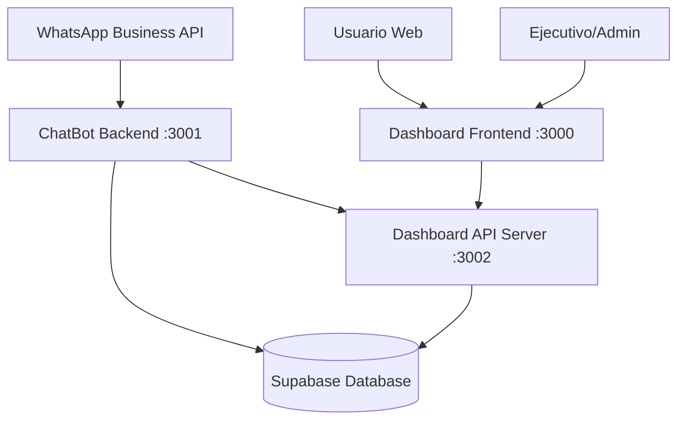
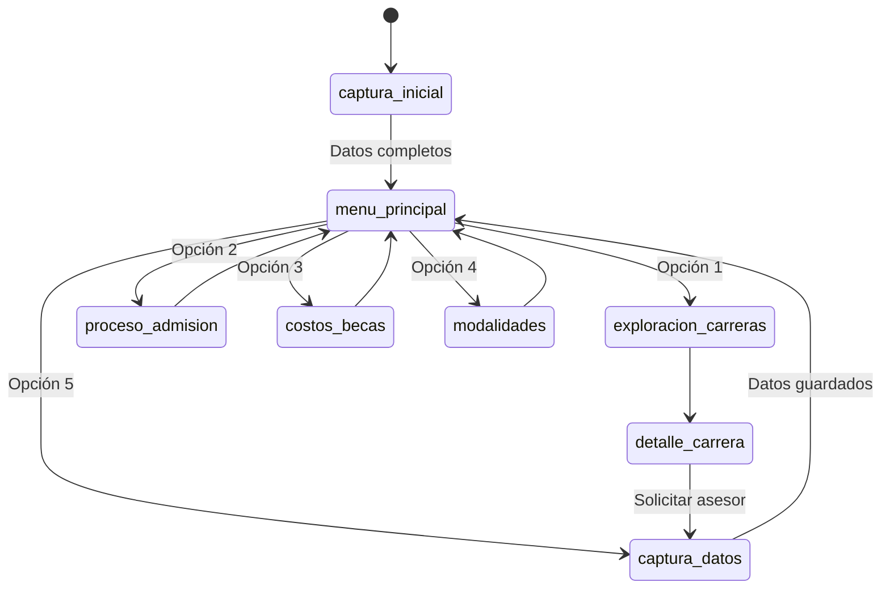
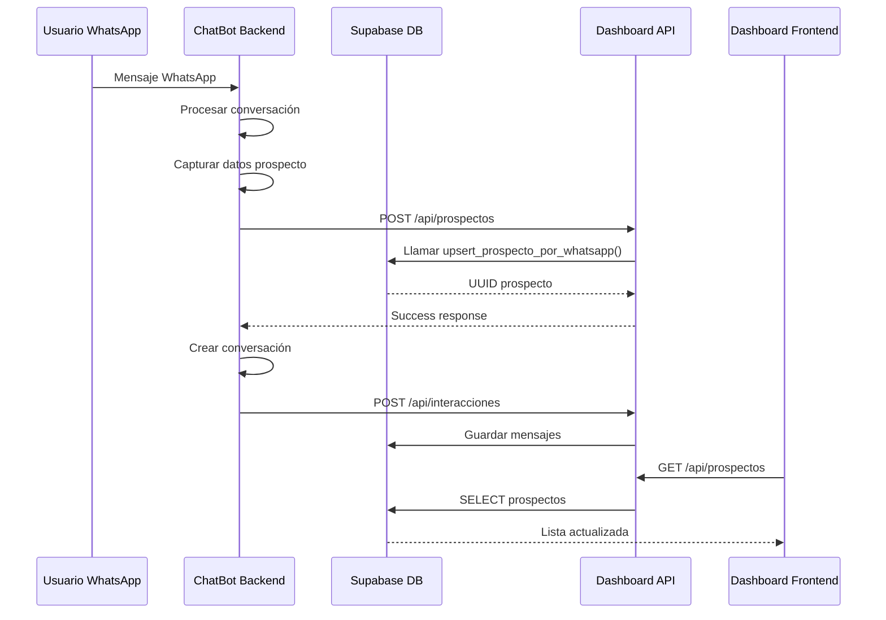
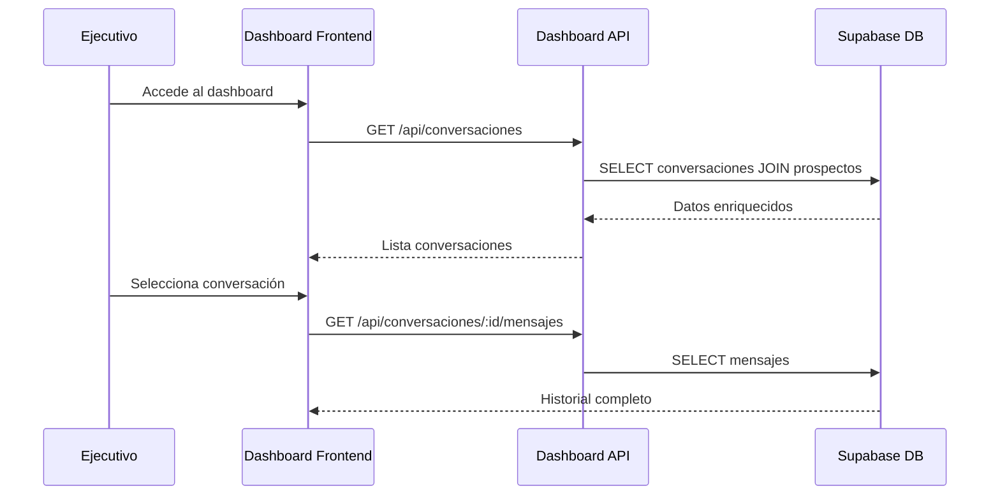

# 🏗️ Arquitectura del Sistema ChatBot UNIACC

## 📋 Índice
1. [Visión General](#vision-general)
2. [Arquitectura de Microservicios](#arquitectura-de-microservicios)
3. [Chatbot Backend](#chatbot-backend)
4. [Dashboard Frontend](#dashboard-frontend)
5. [Dashboard API Server](#dashboard-api-server)
6. [Base de Datos (Supabase)](#base-de-datos-supabase)
7. [Flujo de Datos](#flujo-de-datos)
8. [Configuración de Puertos](#configuracion-de-puertos)
9. [Variables de Entorno](#variables-de-entorno)
10. [Estructura de Archivos](#estructura-de-archivos)

---

## 🎯 Visión General

El sistema ChatBot UNIACC está diseñado como una arquitectura de microservicios que permite:
- **Captura automática de prospectos** a través de WhatsApp
- **Gestión centralizada** de conversaciones y prospectos
- **Dashboard en tiempo real** para seguimiento de leads
- **Integración con Supabase** para persistencia de datos



---

## 🔧 Arquitectura de Microservicios

### Servicios Principales

| Servicio | Puerto | Tecnología | Propósito |
|----------|--------|------------|-----------|
| **ChatBot Backend** | 3001 | Node.js + TypeScript | Bot de WhatsApp y lógica de negocio |
| **Dashboard API Server** | 3002 | Node.js + Express | API REST para el dashboard |
| **Dashboard Frontend** | 3000 | Vue.js + Vite | Interfaz web administrativa |

### Servicios Externos

| Servicio | URL | Propósito |
|----------|-----|-----------|
| **Supabase** | https://vtwdmyezyvhprwonengu.supabase.co | Base de datos PostgreSQL |
| **WhatsApp Business API** | Meta Platform | Integración de mensajería |

---

## 🤖 Chatbot Backend

### **Puerto:** 3001
### **Tecnología:** Node.js + TypeScript + Express

```
chatbot/
├── src/
│   ├── actions/
│   │   ├── uniacc-scripts.ts      # Lógica principal del bot
│   │   └── supabase-integration.ts # Integración con Supabase
│   ├── data/
│   │   ├── programas-uniacc.ts    # Datos de facultades y carreras
│   │   └── respuestas-predefinidas.ts # Respuestas del bot
│   ├── utils/
│   │   └── supabase-client.ts     # Cliente de Supabase
│   └── index.ts                   # Servidor principal
├── .env                           # Variables de entorno
├── package.json
└── tsconfig.json
```

### **Endpoints Principales:**

#### 🔗 API Endpoints
- **GET** `/` - Página principal del bot
- **GET** `/chat` - Interfaz de chat interactiva
- **POST** `/webhook` - Webhook para WhatsApp Business API
- **POST** `/test-chat` - Endpoint para testing del chat
- **GET** `/health` - Health check
- **GET** `/stats` - Estadísticas del bot

#### 🧠 Funcionalidades Clave
- **Gestión de Estado:** Manejo de conversaciones por usuario
- **Flujos Conversacionales:** 
  - Captura inicial de datos
  - Exploración de carreras por facultad
  - Proceso de admisión
  - Información de costos y becas
  - Modalidades de estudio
- **Integración WhatsApp:** Procesamiento de mensajes entrantes
- **Persistencia:** Guardado de prospectos en Supabase

#### 🔄 Flujo de Conversación


---

## 🎨 Dashboard Frontend

### **Puerto:** 3000
### **Tecnología:** Vue.js 3 + Vite + TypeScript

```
dashboard/
├── src/
│   ├── components/
│   │   ├── chat/
│   │   │   ├── ChatInterface.vue    # Interfaz principal de chat
│   │   │   ├── ChatSidebar.vue      # Lista de conversaciones
│   │   │   └── MessageInput.vue     # Input de mensajes
│   │   ├── layout/
│   │   │   ├── Header.vue           # Header principal
│   │   │   └── Sidebar.vue          # Navegación lateral
│   │   └── prospectos/
│   │       ├── ProspectosList.vue   # Lista de prospectos
│   │       └── ProspectoDetail.vue  # Detalle de prospecto
│   ├── composables/
│   │   ├── useChat.ts               # Lógica de chat
│   │   ├── useProspectos.ts         # Gestión de prospectos
│   │   ├── useMetricas.ts           # Métricas y estadísticas
│   │   ├── useSupabase.ts           # Cliente Supabase
│   │   └── useEjecutivos.ts         # Gestión de ejecutivos
│   ├── views/
│   │   ├── Dashboard.vue            # Dashboard principal
│   │   ├── Chat.vue                 # Vista de chat
│   │   ├── Prospectos.vue           # Gestión de prospectos
│   │   └── Metricas.vue             # Análisis y métricas
│   ├── types/
│   │   └── index.ts                 # Tipos TypeScript
│   └── main.ts                      # Entrada de la aplicación
├── vite.config.ts                   # Configuración de Vite
└── package.json
```

### **Características Principales:**
- **Chat en Tiempo Real:** Interfaz para gestionar conversaciones
- **Gestión de Prospectos:** CRUD completo de leads
- **Métricas y Analytics:** Dashboards con estadísticas
- **Responsive Design:** Optimizado para desktop y mobile
- **TypeScript:** Tipado fuerte para mejor desarrollo

---

## 🔌 Dashboard API Server

### **Puerto:** 3002
### **Tecnología:** Node.js + Express

```
dashboard/
├── server.js                        # Servidor API
├── package.json
└── .env
```

### **Endpoints API:**

#### 📊 Prospectos
- **POST** `/api/prospectos` - Crear nuevo prospecto
- **GET** `/api/prospectos` - Listar todos los prospectos

#### 💬 Conversaciones
- **GET** `/api/conversaciones` - Listar conversaciones
- **GET** `/api/conversaciones/:id/mensajes` - Mensajes de una conversación

#### 📈 Interacciones
- **POST** `/api/interacciones` - Registrar interacción del bot

#### 📊 Estadísticas
- **GET** `/api/stats` - Métricas generales del sistema

#### 🔧 Sistema
- **GET** `/health` - Health check del API
- **POST** `/api/botpress-webhook` - Webhook genérico

### **Funcionalidades:**
- **Proxy para Supabase:** Manejo seguro de conexiones a BD
- **Validación de Datos:** Verificación de campos requeridos
- **Gestión de Errores:** Respuestas estructuradas de error
- **CORS Configurado:** Permite conexiones desde el frontend
- **Rate Limiting:** Protección contra spam (futuro)

---

## 🗄️ Base de Datos (Supabase)

### **URL:** https://vtwdmyezyvhprwonengu.supabase.co
### **Tecnología:** PostgreSQL + Supabase

### **Esquema de Tablas:**

#### 👥 **prospectos**
```sql
CREATE TABLE prospectos (
  id UUID DEFAULT gen_random_uuid() PRIMARY KEY,
  nombre TEXT NOT NULL,
  email TEXT,
  telefono TEXT,
  whatsapp TEXT UNIQUE,
  edad INTEGER,
  region TEXT,
  carrera_interes TEXT,
  facultad_interes TEXT,
  fuente TEXT DEFAULT 'whatsapp_bot',
  estado TEXT DEFAULT 'nuevo',
  ultimo_contacto TIMESTAMP DEFAULT NOW(),
  created_at TIMESTAMP DEFAULT NOW(),
  updated_at TIMESTAMP DEFAULT NOW()
);
```

#### 💬 **conversaciones**
```sql
CREATE TABLE conversaciones (
  id UUID DEFAULT gen_random_uuid() PRIMARY KEY,
  phone_number TEXT NOT NULL,
  contact_name TEXT,
  prospecto_id UUID REFERENCES prospectos(id),
  status TEXT DEFAULT 'active',
  assigned_to UUID,
  message_count INTEGER DEFAULT 0,
  last_message_at TIMESTAMP,
  contact_info JSONB DEFAULT '{}',
  created_at TIMESTAMP DEFAULT NOW(),
  updated_at TIMESTAMP DEFAULT NOW()
);
```

#### 📝 **mensajes**
```sql
CREATE TABLE mensajes (
  id UUID DEFAULT gen_random_uuid() PRIMARY KEY,
  conversacion_id UUID REFERENCES conversaciones(id),
  content TEXT NOT NULL,
  type TEXT NOT NULL, -- 'user', 'bot', 'ejecutivo'
  message_type TEXT DEFAULT 'text',
  metadata JSONB DEFAULT '{}',
  created_at TIMESTAMP DEFAULT NOW()
);
```

### **Funciones RPC:**

#### 🔄 **upsert_prospecto_por_whatsapp**
```sql
CREATE OR REPLACE FUNCTION upsert_prospecto_por_whatsapp(
  p_whatsapp text, 
  p_nombre text, 
  p_email text DEFAULT NULL,
  p_edad integer DEFAULT NULL,
  p_region text DEFAULT NULL,
  p_telefono text DEFAULT NULL,
  p_carrera_interes text DEFAULT NULL,
  p_facultad_interes text DEFAULT NULL
) RETURNS uuid
```
**Propósito:** Crear o actualizar prospecto sin duplicados por WhatsApp.

---

## 📊 Flujo de Datos

### **Captura de Prospecto:**


### **Gestión desde Dashboard:**


---

## 🚪 Configuración de Puertos

| Puerto | Servicio | URL | Estado |
|--------|----------|-----|--------|
| **3000** | Dashboard Frontend | http://localhost:3000 | ✅ Desarrollo |
| **3001** | ChatBot Backend | http://localhost:3001 | ✅ Desarrollo |
| **3002** | Dashboard API Server | http://localhost:3002 | ✅ Desarrollo |

### **Configuración Proxy (Vite):**
```typescript
// dashboard/vite.config.ts
server: {
  port: 3000,
  proxy: {
    '/api': {
      target: 'http://localhost:3002',
      changeOrigin: true,
      secure: false
    }
  }
}
```

---

## 🔐 Variables de Entorno

### **ChatBot Backend (.env)**
```env
# Servidor
NODE_ENV=development
BOT_PORT=3001
BOT_HOST=localhost

# WhatsApp Business API
WHATSAPP_VERIFY_TOKEN=uniacc_verify_token_123
WHATSAPP_ACCESS_TOKEN=tu_whatsapp_access_token
WHATSAPP_PHONE_NUMBER_ID=tu_phone_number_id
WHATSAPP_WEBHOOK_SECRET=tu_webhook_secret

# Dashboard Integration
VUE_WEBHOOK_URL=http://localhost:3002/api/prospectos
VUE_WEBHOOK_SECRET=uniacc_webhook_secret_123

# Supabase
SUPABASE_URL=https://vtwdmyezyvhprwonengu.supabase.co
SUPABASE_ANON_KEY=eyJhbGciOiJIUzI1NiIsInR5cCI6IkpXVCJ9...

# UNIACC
UNIACC_WEBSITE=https://www.uniacc.cl
UNIACC_CONTACT_EMAIL=admision@uniacc.cl
UNIACC_PHONE=+56226406000

# Logging
LOG_LEVEL=info
LOG_FILE=logs/bot.log
```

### **Dashboard API Server (.env)**
```env
# Supabase (sin prefijo VITE_)
VITE_SUPABASE_URL=https://vtwdmyezyvhprwonengu.supabase.co
VITE_SUPABASE_ANON_KEY=eyJhbGciOiJIUzI1NiIsInR5cCI6IkpXVCJ9...
VITE_UNIACC_WEBHOOK_SECRET=uniacc_webhook_secret_123
```

### **Dashboard Frontend (.env)**
```env
# Supabase (con prefijo VITE_)
VITE_SUPABASE_URL=https://vtwdmyezyvhprwonengu.supabase.co
VITE_SUPABASE_ANON_KEY=eyJhbGciOiJIUzI1NiIsInR5cCI6IkpXVCJ9...
VITE_PORT=3000
```

---

## 📁 Estructura de Archivos

```
chatboot-uniacc/
├── 📁 chatbot/                     # Backend del ChatBot
│   ├── 📁 src/
│   │   ├── 📁 actions/
│   │   │   ├── 📄 uniacc-scripts.ts
│   │   │   └── 📄 supabase-integration.ts
│   │   ├── 📁 data/
│   │   │   ├── 📄 programas-uniacc.ts
│   │   │   └── 📄 respuestas-predefinidas.ts
│   │   ├── 📁 utils/
│   │   │   └── 📄 supabase-client.ts
│   │   └── 📄 index.ts
│   ├── 📄 .env
│   ├── 📄 package.json
│   └── 📄 tsconfig.json
├── 📁 dashboard/                   # Frontend y API del Dashboard
│   ├── 📁 src/                     # Frontend Vue.js
│   │   ├── 📁 components/
│   │   ├── 📁 composables/
│   │   ├── 📁 views/
│   │   └── 📄 main.ts
│   ├── 📄 server.js               # API Server
│   ├── 📄 vite.config.ts
│   └── 📄 package.json
├── 📄 arquitectura.md             # Este archivo
└── 📄 README.md
```

---

## 🚀 Comandos de Desarrollo

### **Levantar todos los servicios:**

```bash
# Terminal 1: ChatBot Backend
cd chatbot
npm run dev

# Terminal 2: Dashboard API Server  
cd dashboard
npm run dev:server

# Terminal 3: Dashboard Frontend
cd dashboard
npm run dev
```

### **Comandos útiles:**

```bash
# Build para producción
npm run build

# Verificar tipos TypeScript
npm run typecheck

# Ejecutar tests
npm run test

# Logs del sistema
tail -f chatbot/logs/bot.log
```

---

## 🔧 Consideraciones Técnicas

### **Escalabilidad:**
- ✅ Arquitectura de microservicios
- ✅ Base de datos PostgreSQL escalable
- ✅ API REST stateless
- 🔄 Redis para caché (futuro)
- 🔄 Load balancer (futuro)

### **Seguridad:**
- ✅ Variables de entorno para secretos
- ✅ Validación de tokens de WhatsApp
- ✅ CORS configurado
- ✅ Sanitización de inputs
- 🔄 Rate limiting (futuro)
- 🔄 HTTPS en producción

### **Monitoreo:**
- ✅ Health checks en todos los servicios
- ✅ Logging estructurado
- ✅ Métricas básicas
- 🔄 APM (Application Performance Monitoring)
- 🔄 Alertas automáticas

### **Backup y Recovery:**
- ✅ Backups automáticos de Supabase
- ✅ Fallback de prospectos a archivos JSON
- 🔄 Replicación de BD
- 🔄 Disaster recovery plan

---

## 📝 Notas de Desarrollo

### **Estado Actual:**
- ✅ MVP completamente funcional
- ✅ Captura de prospectos operativa
- ✅ Dashboard básico funcionando
- ✅ Integración Supabase estable
- ✅ Flujos conversacionales completos

### **Próximas Mejoras:**
- 🔄 Integración WhatsApp Business API real
- 🔄 Sistema de notificaciones en tiempo real
- 🔄 Analytics avanzados
- 🔄 CRM integrado
- 🔄 Automatización de seguimiento

---

**Última actualización:** 26 de Agosto, 2025  
**Versión:** 1.0.0  
**Autor:** Juan Pablo Silva feat Claude AI