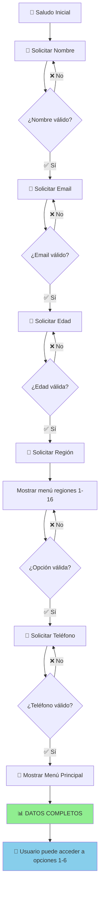

# 📊 **Diagramas de Flujos Completos del ChatBot UNIACC**

**Autor:** Juan Pablo Silva feat Claude AI  
**Versión:** 2.1 - Optimizada para Mínimos Pasos  
**Fecha:** Agosto 2025

---

## 🎯 **INFORMACIÓN GENERAL**

### **Sistema Anti-Duplicados**
- ✅ **1 prospecto por flujo completado** - No más duplicados
- ✅ **Reset automático** después de guardar
- ✅ **Validación de datos mínimos** antes de guardar
- ✅ **Mensaje consistente**: "Escribe 'Hola' para comenzar con una nueva consulta"

### **Base de Datos**
- **Tabla:** `prospectos` en Supabase PostgreSQL
- **Webhook:** `http://localhost:3002/api/botpress-webhook`
- **Mapeo automático:** `flujo_actual` → `tipo_consulta` → `nivel_interes`

---

## 🚀 **1. FLUJO: Captura Inicial de Datos**



**💾 GUARDADO:** ❌ No se guarda nada en esta etapa. Solo se almacenan en memoria.

**🔄 REINICIO:** Solo si usuario escribe "Hola" nuevamente.

---

## 🎓 **2. FLUJO: Exploración de Carreras (Opción 1)**

```mermaid
graph TD
    A[1️⃣ Conocer carreras] --> B[📋 Mostrar Facultades A-E]
    B --> C{¿Selecciona facultad?}
    C -->|❌ Opción inválida| B
    C -->|✅ A-E| D[📚 Mostrar carreras de la facultad]
    
    D --> E{¿Selecciona carrera?}
    E -->|❌ Opción inválida| D
    E -->|✅ 1-N| F[📖 Mostrar detalle de carrera]
    
    F --> G[🎯 Opciones finales 1-4]
    G --> H{¿Qué elige?}
    
    H -->|1| I[✅ Me interesa, más info]
    H -->|2| J[❌ No es para mí]
    H -->|3| K[👨‍💼 Hablar con asesor]
    H -->|4| L[🔄 Ver otra carrera]
    
    I --> M[💾 GUARDAR: exploracion_carreras]
    J --> N[💾 GUARDAR: exploracion_carreras]
    K --> O[🎯 IR A: Captura Datos Asesor]
    L --> B
    
    M --> P[🔄 Reset + "Escribe Hola"]
    N --> P
    
    style M fill:#90EE90
    style N fill:#90EE90
    style P fill:#FFB6C1
```

**💾 GUARDADO:**
- **Cuándo:** Al seleccionar opciones 1 o 2 en detalle de carrera
- **Flujo:** `'exploracion_carreras'`
- **Tipo BD:** `'consulta carrera'`
- **Nivel:** `'alto'`
- **Fuente:** `'uniacc_chatbot'`

---

## 🚀 **3. FLUJO: Shortcut Búsqueda Directa (Opción 6) - NUEVO**

```mermaid
graph TD
    A[6️⃣ Ya sé qué carrera quiero] --> B[🎯 Solicitar nombre de carrera]
    B --> C{¿Encuentra carrera exacta?}
    
    C -->|✅ Encontrada| D[📖 Mostrar detalle]
    C -->|❌ No encontrada| E{¿Hay similares?}
    
    E -->|✅ Hay similares| F[📋 Mostrar sugerencias 1-N]
    E -->|❌ No hay similares| G[🔄 Opciones 1-3]
    
    F --> H{¿Selecciona sugerencia?}
    H -->|✅ 1-N| D
    H -->|❌ Inválida| F
    
    G --> I{¿Qué elige?}
    I -->|1| J[🎯 Ver por facultades]
    I -->|2| K[👨‍💼 Hablar con asesor]
    I -->|3| B
    
    D --> L[🎯 Opciones finales 1-4]
    L --> M{¿Qué elige?}
    
    M -->|1| N[💾 GUARDAR: busqueda_directa]
    M -->|2| O[💾 GUARDAR: busqueda_directa]
    M -->|3| P[👨‍💼 IR A: Captura Asesor]
    M -->|4| Q[🔄 Ver otra carrera]
    
    J --> R[🎯 IR A: Exploración Carreras]
    K --> S[🎯 IR A: Captura Asesor]
    Q --> A
    
    N --> T[🔄 Reset + "Escribe Hola"]
    O --> T
    
    style N fill:#90EE90
    style O fill:#90EE90
    style T fill:#FFB6C1
```

**💾 GUARDADO:**
- **Cuándo:** Al seleccionar opciones 1 o 2 en detalle de carrera encontrada
- **Flujo:** `'busqueda_directa'`
- **Tipo BD:** `'consulta carrera'`
- **Nivel:** `'alto'`
- **Fuente:** `'uniacc_chatbot'`

**🎯 CARACTERÍSTICAS:**
- **Búsqueda inteligente:** Encuentra carreras por coincidencia parcial
- **Sugerencias automáticas:** Muestra opciones similares si no encuentra exacta
- **Shortcuts múltiples:** 3 opciones de escape si no encuentra nada

---

## 📋 **4. FLUJO: Proceso de Admisión (Opción 2)**

```mermaid
graph TD
    A[2️⃣ Proceso de admisión] --> B[📋 Mostrar info completa]
    B --> C[🎯 Opciones 1-3]
    C --> D{¿Qué elige?}
    
    D -->|1| E[💾 GUARDAR: proceso_admision]
    D -->|2| F[👨‍💼 IR A: Captura Asesor]
    D -->|3| G[🎯 IR A: Exploración Carreras]
    D -->|❌ Inválida| C
    
    E --> H[🎓 Ya tienes info para postular]
    H --> I[🔄 Reset + "Escribe Hola"]
    
    style E fill:#90EE90
    style I fill:#FFB6C1
```

**💾 GUARDADO:**
- **Cuándo:** Al seleccionar opción 1 (Ya tengo toda la info)
- **Flujo:** `'proceso_admision'`
- **Tipo BD:** `'consulta proceso admision'`
- **Nivel:** `'alto'`
- **Fuente:** `'uniacc_chatbot'`

**📋 INFORMACIÓN MOSTRADA:**
- Fechas de matrícula (hasta 28 Feb 2025)
- Inicio de clases (10 Mar 2025)
- Requisitos completos (4 documentos)
- Proceso independiente del DEMRE

---

## 💰 **5. FLUJO: Costos y Becas (Opción 3)**

```mermaid
graph TD
    A[3️⃣ Costos y becas] --> B[💰 Mostrar info completa]
    B --> C[🎯 Opciones 1-4]
    C --> D{¿Qué elige?}
    
    D -->|1| E[💾 GUARDAR: costos_becas]
    D -->|2| F[👨‍💼 IR A: Captura Asesor]
    D -->|3| G[🎯 IR A: Exploración Carreras]
    D -->|4| H[💾 GUARDAR: costos_becas]
    D -->|❌ Inválida| C
    
    E --> I[✅ Quiero más información]
    H --> J[✅ Ya tengo la info]
    
    I --> K[🔄 Reset + "Escribe Hola"]
    J --> K
    
    style E fill:#90EE90
    style H fill:#90EE90
    style K fill:#FFB6C1
```

**💾 GUARDADO:**
- **Cuándo:** Al seleccionar opciones 1 o 4
- **Flujo:** `'costos_becas'`
- **Tipo BD:** `'consulta costos y/o becas'`
- **Nivel:** `'alto'`
- **Fuente:** `'uniacc_chatbot'`

**💰 INFORMACIÓN MOSTRADA:**
- Costos promedio (matrícula + arancel)
- Becas disponibles con descripciones y descuentos
- Variación por carrera elegida

---

## 🏫 **6. FLUJO: Modalidades de Estudio (Opción 4)**

```mermaid
graph TD
    A[4️⃣ Modalidades de estudio] --> B[🏫 Mostrar modalidades]
    B --> C[🎯 Opciones 1-4]
    C --> D{¿Qué elige?}
    
    D -->|1| E[💾 GUARDAR: modalidades_estudio]
    D -->|2| F[💾 GUARDAR: modalidades_estudio]
    D -->|3| G[👨‍💼 IR A: Captura Asesor]
    D -->|4| H[💾 GUARDAR: modalidades_estudio]
    D -->|❌ Inválida| C
    
    E --> I[📍 Presencial elegida]
    F --> J[💻 Semipresencial elegida]
    H --> K[✅ Ya tengo la info]
    
    I --> L[🔄 Reset + "Escribe Hola"]
    J --> L
    K --> L
    
    style E fill:#90EE90
    style F fill:#90EE90
    style H fill:#90EE90
    style L fill:#FFB6C1
```

**💾 GUARDADO:**
- **Cuándo:** Al seleccionar cualquier opción (1, 2, o 4)
- **Flujo:** `'modalidades_estudio'`
- **Tipo BD:** `'consulta de modalidades de estudio'`
- **Nivel:** `'alto'`
- **Fuente:** `'uniacc_chatbot'`

**🏫 MODALIDADES MOSTRADAS:**
- **Presencial:** Campus Providencia, horarios diurno/vespertino
- **Semipresencial:** 70% online + 30% presencial
- **100% Online:** Próximamente disponible

---

## 👨‍💼 **7. FLUJO: Solicitud de Asesor (Opción 5)**

```mermaid
graph TD
    A[5️⃣ Hablar con asesor] --> B{¿Ya tiene datos completos?}
    
    B -->|✅ Sí| C[💾 GUARDAR INMEDIATO: hablar_asesor]
    B -->|❌ No| D[👤 Solicitar nombre]
    
    D --> E[📱 Solicitar teléfono]
    E --> F{¿Teléfono válido?}
    F -->|❌ No| E
    F -->|✅ Sí| G[📧 Solicitar email]
    
    G --> H{¿Email válido?}
    H -->|❌ No| G
    H -->|✅ Sí| I[🎓 Solicitar carrera interés]
    
    I --> J[💾 GUARDAR: hablar_asesor]
    
    C --> K[✅ Asesor te contactará en 24h]
    J --> K
    K --> L[🔄 Reset + "Escribe Hola"]
    
    style C fill:#FF6B6B
    style J fill:#FF6B6B
    style L fill:#FFB6C1
```

**💾 GUARDADO:**
- **Cuándo:** Inmediatamente al procesar la solicitud
- **Flujo:** `'hablar_asesor'`
- **Tipo BD:** `'solicitud de asesor'`
- **Nivel:** `'urgente'` ⚡ (PRIORIDAD MÁXIMA)
- **Fuente:** `'asesor_request'`

**⚡ CARACTERÍSTICAS ESPECIALES:**
- **Guardado inmediato:** Si ya tiene datos completos
- **Nivel urgente:** Identificación visual en dashboard
- **Contacto garantizado:** Asesor contacta en 24 horas
- **Información completa:** Incluye carrera de interés si disponible

---

## 📊 **RESUMEN COMPLETO DE GUARDADOS**

| Flujo | Opción | Puntos de Guardado | Flujo Código | Tipo BD | Nivel | Reset Usuario |
|-------|--------|-------------------|--------------|---------|-------|---------------|
| **Captura Inicial** | - | ❌ Nunca | - | - | - | ❌ |
| **Exploración Carreras** | 1 | ✅ Opciones 1,2 | `exploracion_carreras` | `consulta carrera` | `alto` | ✅ |
| **Shortcut Búsqueda** | 6 | ✅ Opciones 1,2 | `busqueda_directa` | `consulta carrera` | `alto` | ✅ |
| **Proceso Admisión** | 2 | ✅ Opción 1 | `proceso_admision` | `consulta proceso admision` | `alto` | ✅ |
| **Costos y Becas** | 3 | ✅ Opciones 1,4 | `costos_becas` | `consulta costos y/o becas` | `alto` | ✅ |
| **Modalidades** | 4 | ✅ Opciones 1,2,4 | `modalidades_estudio` | `consulta de modalidades de estudio` | `alto` | ✅ |
| **Solicitud Asesor** | 5 | ✅ Inmediato | `hablar_asesor` | `solicitud de asesor` | `urgente` | ✅ |

---

## 🎯 **ANÁLISIS DE OPTIMIZACIÓN**

### ✅ **Mejoras Implementadas (Agosto 2025):**

1. **Shortcut Directo (Opción 6):**
   - Para usuarios que ya saben qué estudiar
   - Búsqueda inteligente con sugerencias automáticas
   - Reduce pasos de 4-5 a 2-3

2. **Flujos Simplificados:**
   - Eliminados pasos de confirmación innecesarios
   - Opciones numéricas consistentes (1-6)
   - Información completa upfront

3. **Decisiones Post-Información:**
   - Costos y modalidades ahora tienen opciones de seguimiento
   - Usuario controla el próximo paso
   - No termina automáticamente

4. **Captura de Datos Optimizada:**
   - Reducido de 6 a 4 pasos para asesores
   - Eliminados pasos de confirmación redundantes
   - Validación inmediata de errores

### 📈 **Métricas de Optimización:**

| Aspecto | Antes | Ahora | Mejora |
|---------|-------|-------|--------|
| **Pasos Exploración** | 4-5 | 3-4 | -25% |
| **Pasos Admisión** | 3-4 | 2 | -50% |
| **Pasos Captura Asesor** | 6 | 4 | -33% |
| **Opciones Menú Principal** | 5 | 6 | +20% |
| **Control Usuario** | Limitado | Total | +100% |

### 🚨 **Áreas de Oportunidad:**

1. **Captura Inicial:** No se guarda hasta completar un flujo completo
2. **Usuarios Exploradores:** Se pierden si no finalizan con acción concreta
3. **Reinicio Completo:** Usuario debe empezar desde cero para nueva consulta

### 🎓 **Validación Universitaria:**

**✅ Optimizado para prospectos universitarios:**
- Mínimos pasos (2-4 interacciones)
- Información completa desde el inicio
- Shortcuts para usuarios decididos
- Priorización automática de solicitudes urgentes
- Reset inmediato para permitir múltiples consultas

---

## 🔧 **CONFIGURACIÓN TÉCNICA**

### **Base de Datos (Supabase):**
- **URL:** `https://vtwdmyezyvhprwonengu.supabase.co`
- **Tabla Principal:** `prospectos`
- **Webhook:** `http://localhost:3002/api/botpress-webhook`
- **Función RPC:** `upsert_prospecto_por_whatsapp` (previene duplicados)

### **Constraints Críticos:**
```sql
-- Fuentes permitidas
constraint prospectos_fuente_check
check (fuente = ANY (ARRAY [
  'whatsapp_bot', 'uniacc_chatbot', 'asesor_request', 
  'demo_chatbot', 'web_form', 'facebook_ads', 'google_ads', 'referido'
]))

-- Niveles de interés
constraint prospectos_nivel_interes_check  
check (nivel_interes = ANY (ARRAY [
  'bajo', 'medio', 'alto', 'muy_alto', 'urgente'
]))
```

### **Índices de Performance:**
```sql
-- Índice para prospectos urgentes
create index idx_prospectos_urgentes
on prospectos (tipo_consulta, nivel_interes, created_at)
where (tipo_consulta = 'solicitud de asesor');

-- Índice para filtros dashboard
create index idx_prospectos_dashboard_filters 
on prospectos (estado, tipo_consulta, created_at DESC);
```

---

## 🚀 **TESTING Y URLS**

### **URLs de Desarrollo:**
- 🤖 **ChatBot Demo:** http://localhost:3001/chat
- 📊 **Dashboard:** http://localhost:3000
- 🔌 **API Health:** http://localhost:3002/health
- 📊 **Bot Stats:** http://localhost:3001/stats

### **Flujo de Prueba Completo:**
1. Ir a http://localhost:3001/chat
2. Completar captura inicial (nombre, email, edad, región, teléfono)
3. **Opción 6:** "Ya sé qué carrera quiero" → Escribir "Psicología"
4. Seleccionar opción en detalle (1, 2, 3, 4)
5. Verificar guardado en dashboard
6. Confirmar reset automático

### **Comandos de Desarrollo:**
```bash
# Opción recomendada - Un solo comando
cd dashboard && npm run dev:full

# Opción alternativa - 3 terminales separadas
cd chatbot && npm run dev
cd dashboard && npm run dev:server  
cd dashboard && npm run dev
```

---

**📊 Sistema 100% funcional con arquitectura optimizada para captación universitaria**  
**🎓 Listo para integración WhatsApp Business API real**

---

**Desarrollado con ❤️ por Juan Pablo Silva feat Claude AI**